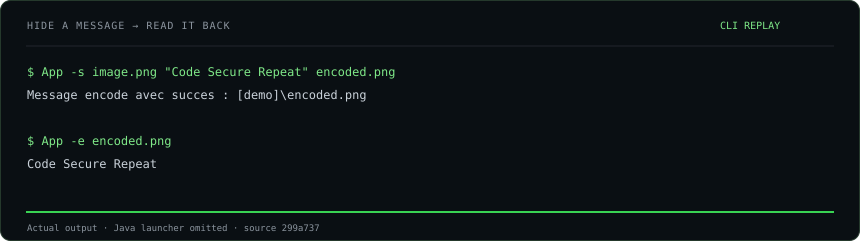
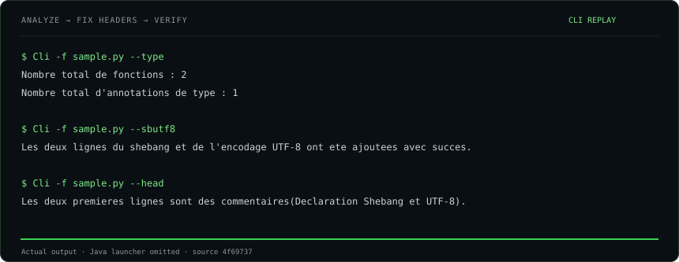



### About

### Selected projects

[Explore my repositories →](https://github.com/Aybskt?tab=repositories)

### Toolbox

### Activity

### Inside the terminal

### Connect

[Discord](https://discord.com/users/533606000431726594) · [GitHub](https://github.com/Aybskt) · [Buy me a coffee](https://www.buymeacoffee.com/aybskt)

Code · Secure · Repeat.
